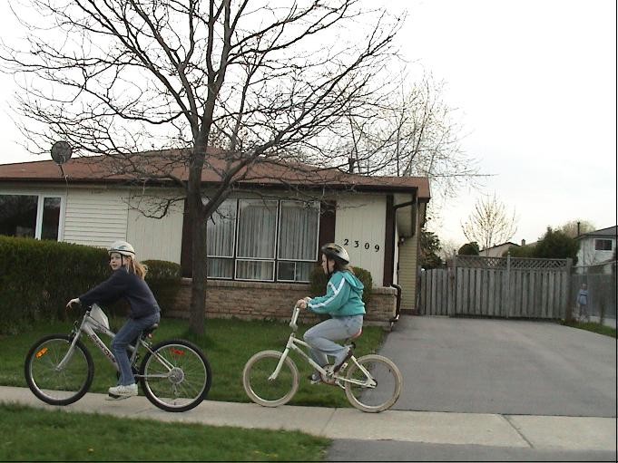

# VisualAttention-Rare2007

Input image

Saliency map

**RARE2007 is purely bottom-up using only color information (no orientation information).**

This is the code written in 2007 by Matei Mancas during his PhD (called LG2 in the PhD thesis). RARE2007 is purely bottom-up using only color information (no orientation information). It uses neither object detectors like face detection, nor tuning for natural images like centered Gaussians. RARE2007 is less good than RARE2012, but the resulting saliency map is more precise which can be suitable for some applications like image compression.