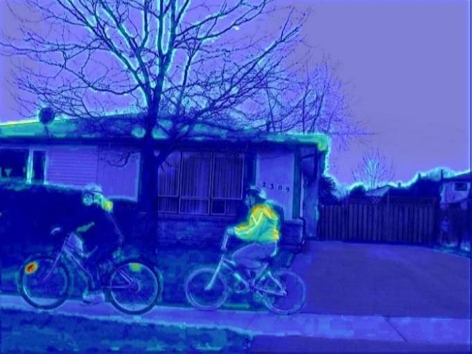

# Rare2007 (R2007)
Rarity is computed on color features only. This model is a "feature engineered saliency model". Just apply it one your images. A full paper can be found here : [Main Rare2007 paper](https://www.researchgate.net/profile/Matei_Mancas/publication/221559276_Relative_Influence_of_Bottom-Up_and_Top-Down_Attention/links/09e4150c1b7dc86ef2000000.pdf).
If you use R2007, please cite :   
  
> @inproceedings{mancas2008relative,
  title={Relative influence of bottom-up and top-down attention},
  author={Mancas, Matei},
  booktitle={International Workshop on Attention in Cognitive Systems},
  pages={212--226},
  year={2008},
  organization={Springer}
}

### How to run

Just type in Matlab:

```matlab
>> example
```

The main function takes an image and shows results. 

### Paper results reproduction

The result from this code is the raw data which will not let you reproduce exactly the paper results. For this purpose you still need to low-pass filter the results and, for natural images datasets (such as MIT1003 ...), add also a centred Gaussian.  

Figure 1: Input image

 

Figure 2: Saliency map



### Requirements

The codes were tested with the following configuration: 

Matlab

### Licence

This code is free to use, modify or integrate in other projects if the final code is for research and non-profit purposes and if our paper is cited in the code and any publication based on this code. This code is NOT free for commercial use. For commercial use, please contact matei.mancas@umons.ac.be 

### Waranty

This code is provided 'as is' with no waranty or responsability from the authors or their institution. 

### Contributing
Pull requests are welcome. For major changes, please open an issue first to discuss what you would like to change.
